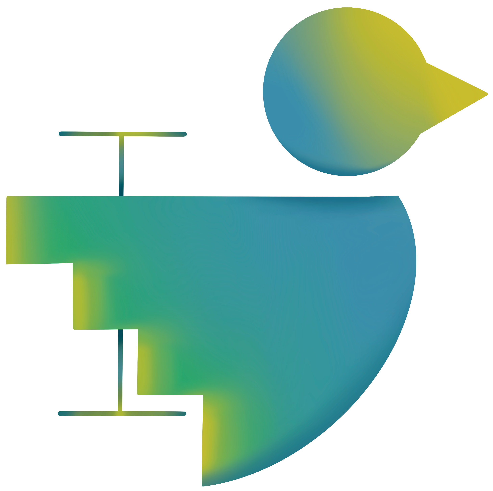
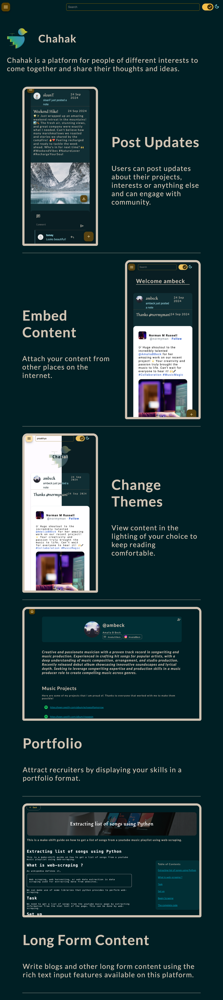

<!-- Improved compatibility of back to top link: See: https://github.com/othneildrew/Best-README-Template/pull/73 -->

<!--
*** Thanks for checking out the Best-README-Template. If you have a suggestion
*** that would make this better, please fork the repo and create a pull request
*** or simply open an issue with the tag "enhancement".
*** Don't forget to give the project a star!
*** Thanks again! Now go create something AMAZING! :D
-->

<!-- PROJECT SHIELDS -->
<!--
*** I'm using markdown "reference style" links for readability.
*** Reference links are enclosed in brackets [ ] instead of parentheses ( ).
*** See the bottom of this document for the declaration of the reference variables
*** for contributors-url, forks-url, etc. This is an optional, concise syntax you may use.
*** https://www.markdownguide.org/basic-syntax/#reference-style-links
-->
[![Contributors][contributors-shield]][contributors-url]
[![Forks][forks-shield]][forks-url]
[![Stargazers][stars-shield]][stars-url]
[![Issues][issues-shield]][issues-url]
[![GPL License][license-shield]][license-url]
[![LinkedIn][linkedin-shield]][linkedin-url]

<!-- PROJECT LOGO -->
 

  

  <h1 align="center">Chahak</h3>
  <h5>Support</h5>

  

    Support for the Chahak project. A new platform for people fo different interests to share ideas.
     
     
     
    <kbd>   <a href="https://github.com/praakhya/chahak-support/issues/new?assignees=&labels=bug&projects=&template=bug_report.md&title=%5BBUG%5D">Report Bug</a>   </kbd>
    <kbd>   <a href="https://github.com/praakhya/chahak-support/issues/new?assignees=&labels=enhancement&projects=&template=feature_request.md&title=%5BFEATURE%5D">Request Feature</a>   </kbd>
  

<!-- TABLE OF CONTENTS -->

  
Table of Contents

  <ol>
    <li>
      <a href="#about-the-project">About The Project</a>
    </li>
      <li><a href="#built-with">Built With</a></li>
    <li><a href="#usage">Usage</a></li>
    <li><a href="#roadmap">Roadmap</a></li>
    <li><a href="#license">License</a></li>
    <li><a href="#contact">Contact</a></li>
  </ol>

<!-- ABOUT THE PROJECT -->
# About The Project

[![Product Name Screen Shot][product-screenshot]](https://example.com)

There are many great platforms that serve as a social presence for people of a variety of backgrounds. However, I felt that those platforms often allow a user to *showcase a single aspect of their skill*, often conforming just to their careers. I created Chahak with the intention of making *a single platform that lets people share ideas in different forms from short notes to long articles*.

I hope to add more features in the future to make this another flourishing platform that can adapt to user's needs to express ideas.

(<a href="#readme-top">back to top</a>)

# Built With

* [![Angular][Angular.io]][Angular-url]
* [![Spring][Spring.io]][Spring-url]
* [![Spring][Java]][Java-url]
* ![Html][HTML]
* ![Scss][SCSS]
* [![Mongo][Mongo]][Mongo-url]

(<a href="#readme-top">back to top</a>)

<!-- USAGE EXAMPLES -->
# Usage

(<a href="#readme-top">back to top</a>)

<!-- ROADMAP -->
# Roadmap

- [x] Add authentication
- [x] Add notes, notepads and article editing
- [x] Add portifolio style profile
- [ ] Add content segregation using tags
- [ ] Add article topics
- [ ] Add workspace type features

See the [open issues](https://github.com/praakhya/chahak-support/issues) for a full list of proposed features (and known issues).

(<a href="#readme-top">back to top</a>)

<!-- CONTRIBUTING -->

<!-- LICENSE -->
# License

Distributed under GPL. See `LICENSE` for more information.

(<a href="#readme-top">back to top</a>)

<!-- CONTACT -->
# Contact
[![Email][Email]][email-url]

(<a href="#readme-top">back to top</a>)

<!-- MARKDOWN LINKS & IMAGES -->
<!-- https://www.markdownguide.org/basic-syntax/#reference-style-links -->
[contributors-shield]: https://img.shields.io/github/contributors/praakhya/chahak-support.svg?style=for-the-badge
[contributors-url]: https://github.com/praakhya/chahak-support/network/dependencies
[forks-shield]: https://img.shields.io/github/forks/praakhya/chahak-support.svg?style=for-the-badge
[forks-url]: https://github.com/praakhya/chahak-support/network/members
[stars-shield]: https://img.shields.io/github/stars/praakhya/chahak-support.svg?style=for-the-badge
[stars-url]: https://github.com/praakhya/chahak-support/stargazers
[issues-shield]: https://img.shields.io/github/issues/praakhya/chahak-support.svg?style=for-the-badge
[issues-url]: https://github.com/praakhya/chahak-support/issues
[license-shield]: https://img.shields.io/badge/License-GPL-blue.svg?style=for-the-badge
[license-url]: https://github.com/praakhya/chahak-support/blob/main/LICENSE
[linkedin-shield]: https://img.shields.io/badge/-LinkedIn-black.svg?style=for-the-badge&logo=linkedin&colorB=555
[linkedin-url]: https://www.linkedin.com/in/praakhyaavasthi/
[product-screenshot]: images/screenshot.png
[Angular.io]: https://img.shields.io/badge/Angular-DD0031?style=for-the-badge&logo=angular&logoColor=white
[Angular-url]: https://angular.io/
[Spring.io]: https://img.shields.io/badge/Spring-5daa22?style=for-the-badge&logo=spring&logoColor=white
[Spring-url]: https://spring.io/
[Java]: https://img.shields.io/badge/Java-ED8B00?style=for-the-badge&logo=openjdk&logoColor=white
[Java-url]: https://www.java.com/en/
[Mongo]: https://img.shields.io/badge/-MongoDB-13aa52?style=for-the-badge&logo=mongodb&logoColor=white
[Mongo-url]: https://www.mongodb.com/
[Html]: https://img.shields.io/badge/HTML-239120?style=for-the-badge&logo=html5&logoColor=white
[Scss]: https://img.shields.io/badge/SCSS-CC6699?style=for-the-badge&logo=Sass&logoColor=white
[Email]: https://img.shields.io/badge/Praakhya_Avasthi-EA4335?style=flat&logo=gmail&logoColor=white
[Email-id]: praakhya@chahak.in
[Email-url]: mailto:praakhya@chahak.in
[Link]: # 'Link with example title.'
[Report-bug-url]: https://github.com/praakhya/chahak-support/issues/new?assignees=&labels=bug&projects=&template=bug_report.md&title=%5BBUG%5D
